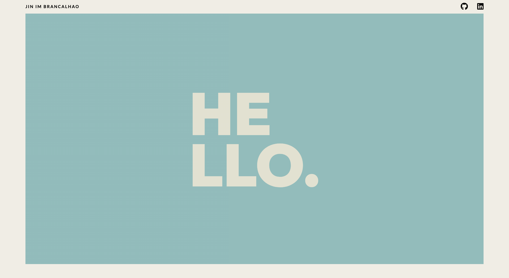
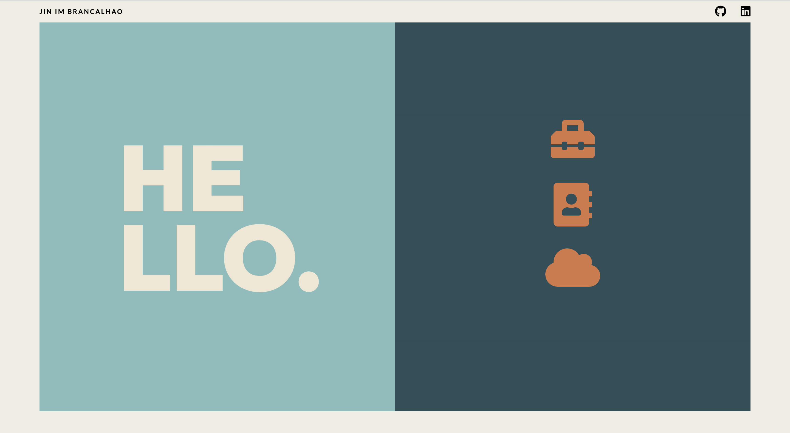

## Date: 11/13/2022

### By:

### Jin Im Brancalhao

[GitHub](https://github.com/jinimbrancalhao) | [LinkedIn](https://www.linkedin.com/in/jinimb/)

---

**_Description_**

I found a website with a design I really liked - [Wokine](https://www.wokine.com/). In particular I enjoyed the homescreen design and animation. To get some practice with CSS, I tried to make my own version of that.

There is a very cool animation on the Wokine homepage where the central red body of the homescreen shrinks from covering essentially the whole screen to only the left half. This was the most difficult animation to mimic. What I decided to do is take what the left half panel would look like after the animation and create that same panel on the right side. By default this panel has a z-index of 0 so it was not visible to the user. I then added an animation I called "backgroundFade" which took this panel, made it visible, slid it to the left hand side, then faded away thus mimicking the shrinking panel of the Wokine homepage.

---

**_Techs and Tools Used_**

- React
- Node.js
- CSS
- FontAwesome

---

**_Getting Started_**

- ### [Application](https://homepage-styling-practice.netlify.app/)

---

**_Screenshots_**

Before Homepage Animation

After Homepage Animation

---

**_Future Updates_**

- [ ] Add scroll animations
- [ ] Build out further functionality

---

**_Credits_**

#### Design Inspiration: [Wokine](https://www.wokine.com/)

#### Icons: [Fontawesome](https://fontawesome.com)
